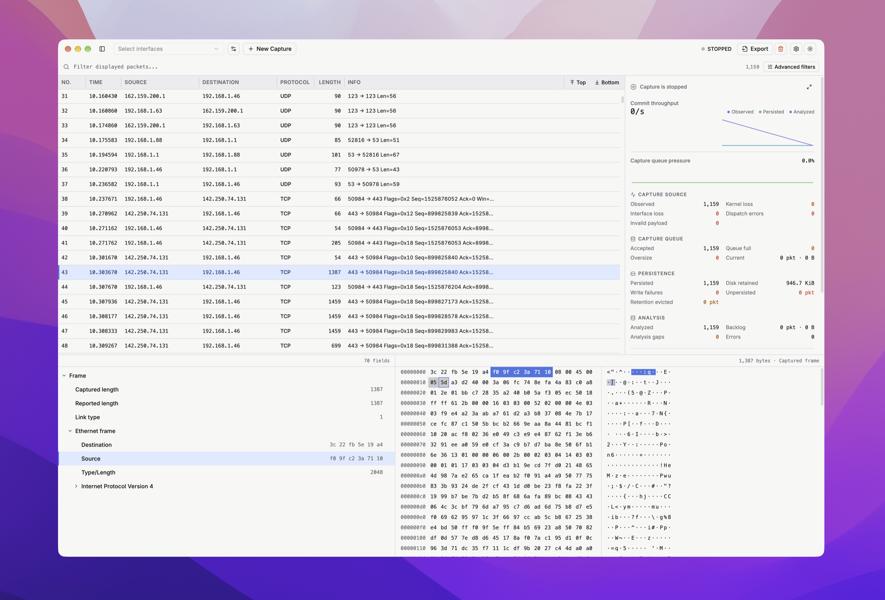

# Pruftnet

Cross-platform network analysis software. **Beta, new generation starting at 0.2.0.** Website: [pruftnet.app](https://pruftnet.app).

<picture>
  <source media="(prefers-color-scheme: dark)" srcset=".github/assets/preview-dark.png">
  <source media="(prefers-color-scheme: light)" srcset=".github/assets/preview-light.png">
  
</picture>

## Install

Download Desktop installers or standalone Server archives from [Releases](https://github.com/franktronics/pruftnet.app/releases).

- Desktop and Server: macOS 15+ Intel/Apple Silicon, Windows x64, Linux x64/ARM64.
- Linux packages target Ubuntu 24.04+ or Debian 13+. Other distributions need compatible glibc, C++ runtime, and libpcap.
- Server archives include Node. Extract the whole archive, run `./pruftnet serve` (Windows: `pruftnet.cmd serve`), then open http://127.0.0.1:3000.
- Nightly uses `pruftnet-nightly`, port 3001, and separate installation and data directories.

### Server

`pruftnet serve` binds only to loopback addresses until authentication is implemented. Desktop and Server databases are separate; an explicit `--data-dir` or `PRUFTNET_DATA_DIR` is not migrated automatically.

- `pruftnet doctor` checks the configuration, data directory, port, native worker and capture permissions, and explains how to fix failures.
- `pruftnet interfaces` lists capture interfaces. `pruftnet config show` prints the effective settings and where each comes from. `pruftnet --help` lists every option.
- Flags override `PRUFTNET_*` environment variables, which override a JSON file. `pruftnet config path` prints its default location; `--config` selects another file:

```json
{
    "port": 3000,
    "dataDir": "/srv/pruftnet",
    "logLevel": "info",
    "logFormat": "json",
    "strictPort": true
}
```

- A busy port makes `serve` try the next ones, unless `--strict-port` is set. Exit codes: 0 success, 1 failure, 2 invalid usage or configuration, 3 port unavailable.
- Run it as a service with `sudo systemctl enable --now pruftnet-server` (Debian package: `pruftnet` user, `/etc/pruftnet-server/server.json`, data in `/var/lib/pruftnet-server`) or `brew services start pruftnet-server`.

### Capture permissions

macOS builds are ad hoc signed and not notarized. If Gatekeeper blocks the app, first attempt to open it, then choose **Open Anyway** in System Settings > Privacy & Security. Do not disable Gatekeeper globally. Live capture needs access to `/dev/bpf*`; a Wireshark ChmodBPF installation provides this. Otherwise an administrator may temporarily run:

```sh
sudo chown "$USER" /dev/bpf*
```

On Windows, install [Npcap](https://npcap.com/#download) before starting Pruftnet. It is not bundled. Installers are currently unsigned and Windows may show a publisher warning.

On Linux, capture capabilities belong only to the native worker, never to the desktop or server process. The Debian server package grants them at installation and lets only root and members of the `pruftnet` group run the worker. Join the group, then log in again:

```sh
sudo usermod -aG pruftnet "$USER"
```

For the desktop package and server archives, grant them manually and repeat after upgrades:

```sh
sudo setcap cap_net_raw,cap_net_admin=eip /opt/Pruftnet/resources/native/pruftnet_capture_worker
```

AppImage cannot retain file capabilities, so use the Debian package for live capture. Do not run Pruftnet as root.

### Package managers

After the first repository publication, install on macOS with:

```sh
brew install --cask franktronics/pruftnet/pruftnet-desktop
brew install franktronics/pruftnet/pruftnet-server
```

On Ubuntu or Debian, configure the signed APT repository once:

```sh
sudo install -d -m 0755 /etc/apt/keyrings
curl -fsSL https://franktronics.github.io/pruftnet.app/pruftnet.asc | sudo tee /etc/apt/keyrings/pruftnet.asc >/dev/null
printf '%s\n' 'deb [signed-by=/etc/apt/keyrings/pruftnet.asc] https://franktronics.github.io/pruftnet.app main main' | sudo tee /etc/apt/sources.list.d/pruftnet.list
sudo apt update
sudo apt install pruftnet-desktop pruftnet-server
```

Append `-nightly` to package names for nightly. Homebrew is macOS only. In-app auto-update is not available yet.

## Development

Use Node from `.node-version`, pnpm from `package.json`, CMake 3.24+, a C++20 compiler and libpcap development headers (Npcap SDK on Windows).

```sh
pnpm install
pnpm build:cpp
pnpm dev:desktop
# Or:
pnpm dev:server
# Website (apps/site):
pnpm dev:site
```

`packages/core` shares the backend and native worker between Electron and the local HTTP server. `packages/front` shares the React interface; `packages/shared` owns RPC contracts.

## Build and release

```sh
pnpm build
```

Both distributions are written to `release/`. Build on each target operating system. The Windows packaging script requires `NPCAP_SDK` to point to the extracted SDK.

Feature PRs target `dev`; merging publishes a nightly after validation. Promote to `main` and push a version tag for a principal release. `dev-archive` preserves the old application. See [release process](.agents/doc/release.md).
